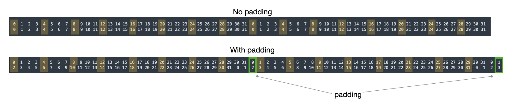

### Intro

If you've read PMPP and looked through some GEMM implementations (lots of nice ones build up a modern GEMM incrementally), but it still hasn't internalized, I hope mine helps. For simplicity we're going to start with a matmul:

```
C = A * B   // C=[M,N], A=[M,K], B=[K,N]
```

This is a classic CUDA tiled implementation, which IMO should be a tale of smart memory design, encapsulating:
- Tiling for data reuse
	- Block tiles of input/output matrices
	- Register tiles for a single thread to accumulate outer products
- Coalesced and vectorized data loads and stores
	- from global memory into shared and stores from registers into global
- Avoiding bank conflicts when accessing shared memory

And we don't worry about features like:
- Double buffering and async data loads from global memory
- Tensor core MMAs

Future TODO: Take this same GEMM, but do it with CuTe layouts.

### Design Note: Memory

Tiling details:

```
BM=128 // rows of A
BK=64 // shared dim (cols of A, rows of B)
BN=128 // cols of B
TM=TN=8 // register tile
```

Each thread block works on `BMxBK` tiles of `A` and `BKxBN` tiles of `B`, stored in shared memory. We can issue vectorized loads and stores with a single PTX instruction, like `ld.global.v4.b32`, which loads 4 32-bit words, or 8 `__half`s (the 2B type used in this GEMM). Vectorized interactions with shared memory occur in the following contexts and with concerns:
- Loading from global: Ensure contiguous threads in a warp issue 128B loads for perfect coalescense.
- Storing and loading from shared: Ensure for each subop in a vectorized load/store, all threads in a warp are operating on different shared memory banks.

Coalescence is pretty simple. `A` and `B` are row major, and sequential threads read sequential 16B chunks of global memory. For `A` tiles have 64 cols = 128 B, so each load gets an optimal coalescence. For `B` tiles with 128 bols, therefore also holds true.

##### Mechanism of the GEMM

If each thread is responsible for a 8x8 output with upper left corner at `[r][c]`, then given block tiles of `A` and `B` in shared memory, we loop over the k-dimension taking the outer product of the `k`th col-segment of `Asmem` and the `k`th row-segment of `Bsmem`, the resulting output is the shape of the thread's tile and accumulates across `k`.

```
for ik in range(0,BK):
	C_tile += outerProd(Asmem[r:r+8][ik], Bsmem[ik][c:c+8])
```

Since we need column segments of `Asmem`, we can transpose `Asmem`, so that threads access 8 contiguous elements via vectorized loads. We now have to be careful to avoid bank conflicts, so padding is due for the shared memory tiles. 

##### Bank Conflicts

With `Asmem` transposed, then both `Asmem` and `Bsmem` are `64x128` with sequential threads accessing sequential 8 element row segments. Therefore, a warp of 32 threads, covers 2 rows. With 4 Bytes per bank, there are 4 banks used by a thread per load, and 64 banks across a row. If we simply load the data as is (adjacent threads load their 16 B contiguous row segments), there will be a 4-way bank conflict. This is illustrated in the top plot of bank numbers of the first two rows. Highlighted are the banks of the 1st subop of the vectorized load for all threads in the warp.



By adding padding equal to one bank after each 64 elements (adding 2 cols in the middle and 2 cols at the end of the matrices), the banks stagger such that now there is no conflict within the subop. In the bottom plot, the banks of the 1st subop for all threads are highlighted again, showing no conflict.


